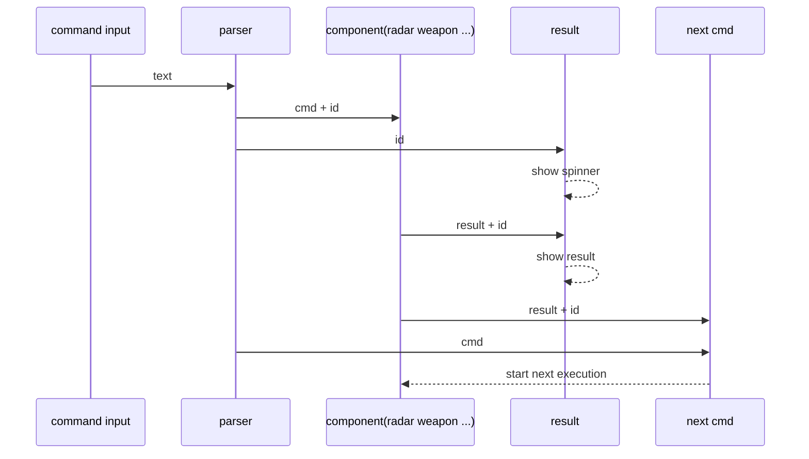
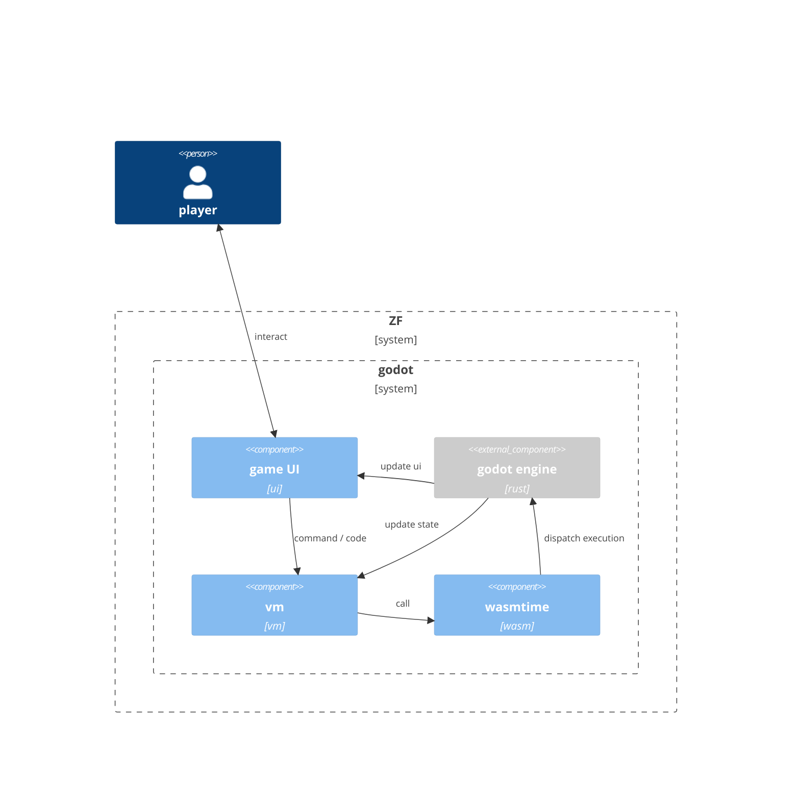

# Some architecture diagrams

## Execution architecture

1. communications between components
2. component(radar weapon ...) holds tmp ref of objects so only can do execution
3. sperate state management from randering code

## Command / Code Runtime

