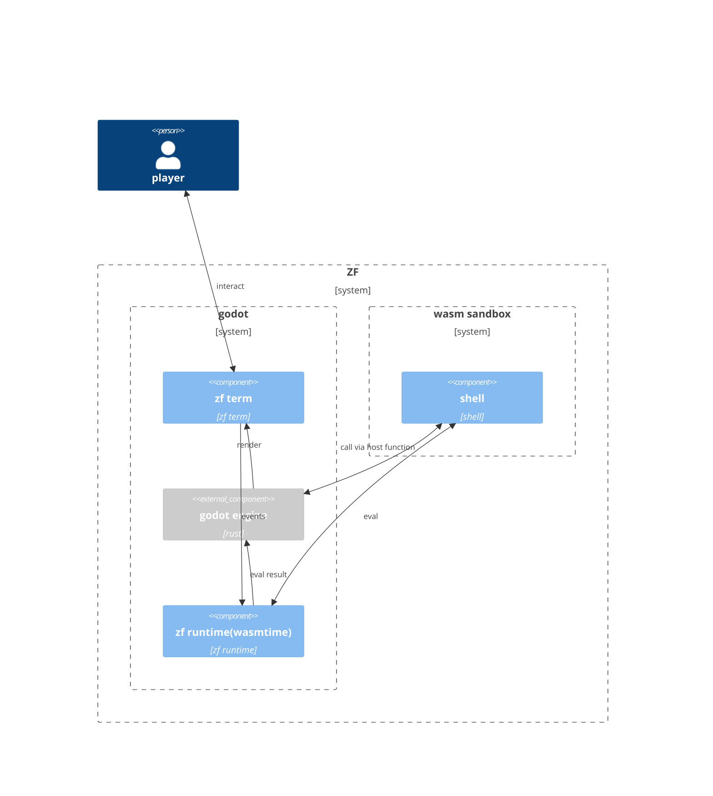

# Some architecture diagrams

## Command / Code Runtime

```mermaid
C4Context
  Person(player ,"player")
  Boundary(zf, "ZF") {
    Boundary("godot", "godot") {
      Component(zf term, "zf term", "zf term")
      Component_Ext(engine, "godot engine", "rust")
      Component(zf runtime, "zf runtime(wasmtime)", "zf runtime")
    }
    Boundary("shell wasm", "wasm sandbox") {
      Component(zf shell, "shell", "shell")
    }
  }

  BiRel(player, zf term, "interact")
  BiRel(zf shell, engine, "call via host function")
  Rel(zf term, zf runtime, "events")
  Rel(zf runtime, engine, "eval result")
  Rel(engine, zf term, "render")
  BiRel(zf runtime, zf shell, "eval")

  UpdateRelStyle(player, zf term, $offsetX="10", $offsetY="5")
  UpdateRelStyle(engine, zf term, $offsetX="-20", $offsetY="-20")
  UpdateRelStyle(engine, zf runtime, $offsetX="-50", $offsetY="-20")
  UpdateRelStyle(zf shell, engine, $offsetX="-50", $offsetY="-20")
  UpdateLayoutConfig($c4ShapeInRow="2")
```
